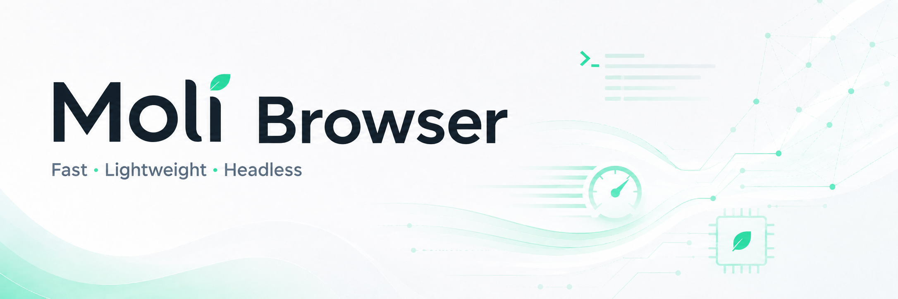
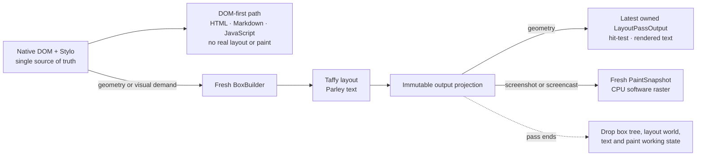
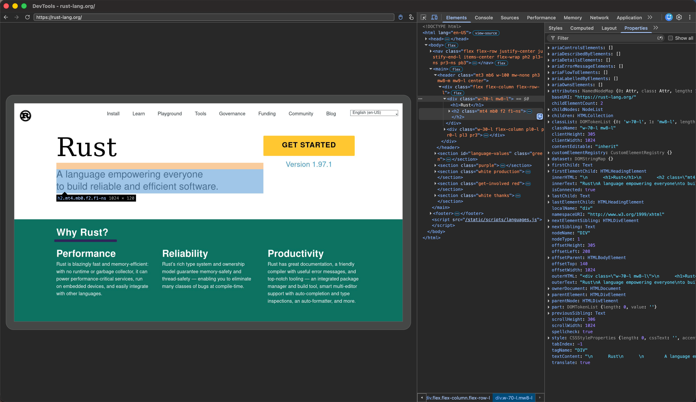

<p align="center">
  
</p>

<h1 align="center">Moli</h1>

<p align="center">
  <strong>A browser engine built for AI agents: DOM-first, pixels on demand.</strong>
</p>

<p align="center">
  Real JavaScript, DOM, and browser APIs · One-shot, non-retained layout and CPU rendering ·
  CLI, MCP, CDP, WebDriver Classic, and WebDriver BiDi
</p>

Moli is a headless browser built from the ground up for web extraction,
automation, and agent workloads. It runs real page JavaScript on V8, maintains
a native DOM and CSS state, implements browser storage and networking, and
exposes the page through structured interfaces before asking an agent to reason
over pixels.

The central idea is simple: **DOM and structured page data are available by
default; pixels are rendered only when requested.** Reading a document,
extracting Markdown, inspecting an accessibility tree, or executing JavaScript
does not need to keep a GUI browser's layout, paint, and compositor machinery
alive. When geometry or pixels do matter, Moli constructs a fresh layout pass
and can produce a software-rendered frame on demand.

## Why Moli

Conventional browsers assume that every loaded page may need to be displayed,
animated, or scrolled at any moment. They therefore keep visual machinery ready
for the next frame—even when an automation task only wants a title, a list of
links, or the result of a JavaScript expression.

An AI agent usually works differently:

1. **Understand the page.** Read DOM structure, text, links, forms, network
   responses, storage, and JavaScript state.
2. **Act on the page.** Use DOM-backed controls and browser APIs to fill,
   select, submit, navigate, or execute code.
3. **Look at the page when necessary.** Ask for geometry when spatial position
   matters, or pixels when a screenshot is the best source of truth.

Moli performs only the visual work required by the current request:

| Agent request | Work performed by Moli |
| --- | --- |
| Extract HTML or Markdown, query the DOM, run JavaScript, or inspect network and storage | Use the browser runtime directly; do not run real layout or paint |
| Read an element box, hit-test a point, or send coordinate input | Build one complete layout pass and keep only the latest owned geometry snapshot |
| Capture a screenshot or refresh a screencast | Rebuild from the current DOM and style, software-render one fresh frame, then discard pass-local visual state |

This is not a browser with rendering removed. Moli still has a real DOM, V8,
CSS state, layout, text shaping, hit-testing, and software paint. The difference
is when those systems run and how long their intermediate state survives: DOM
and browser state are the default interface; layout and pixels are paid for
only when the agent asks for them.

That cost model matters for high-density crawling, browser-use agents,
retrieval pipelines, evaluation environments, and RL workloads, where startup
time, idle memory, and per-page resident state determine how many browser
sessions a machine can support.

## On-demand, non-retained rendering

**Moli does not keep a visual world alive just in case.** The Native DOM and
Stylo state are the single source of truth. DOM and structured-data operations
read that state directly; layout and pixels are constructed only when an
operation actually needs them.



The default server uses `LayoutPolicy::Mock` and never constructs the real
layout or paint pipeline. `--layout` selects `LayoutPolicy::OnDemand`: it makes
real geometry, hit-testing, coordinate input, screenshots, and screencast
available, but it does **not** turn Moli into a continuously rendering browser.

A cold geometry request rebuilds layout once and keeps only the latest owned
geometry snapshot. Ordinary geometry reads may reuse that sampled output;
screenshot and screencast refreshes rebuild from the current DOM and style and
produce a fresh frame. Even screencast is a low-frequency repetition of the
same one-shot pipeline, not a retained 60 FPS compositor.

As a result, extraction, DOM inspection, JavaScript execution, and most agent
actions avoid both the CPU cost of producing unused frames and the resident
memory cost of retained layout, paint, and compositor state.

## What works today

- **Real web runtime.** Streaming HTML parsing, native DOM ownership, V8-backed
  JavaScript, modules, timers, microtasks, events, iframe and worker surfaces,
  CSS cascade/computed style, Fetch/XHR, WebSocket, cookies, WebCrypto, and
  profile-scoped storage including localStorage, IndexedDB, and OPFS.
- **Extraction-first outputs.** HTML, Markdown, JSON, text semantic trees,
  frame-aware serialization, selector/script/response waits, and network
  tracing are available directly from the CLI.
- **Agent-native MCP server.** The stdio server exposes navigation, Markdown,
  links, JavaScript evaluation, semantic trees, interactive-element discovery,
  node inspection, form actions, keyboard input, hover, and scrolling.
- **One automation binary.** CDP, WebDriver Classic, and WebDriver BiDi reuse
  the same browser kernel and typed scheduler model. There is no separate
  ChromeDriver, geckodriver, or browser installation to coordinate.
- **Real visual surfaces on demand.** With `--layout`, Moli uses fresh box
  construction, Taffy layout, Parley text layout, layout-backed hit-testing and
  input, current-viewport screenshots, and low-frequency DevTools screencast
  frames rendered on the CPU.
- **Operational controls.** Profiles, cookies, HTTP cache, proxies, resource
  families, connection limits, timeouts, private-network policy, user-agent
  overrides, structured logging, and network diagnostics are explicit runtime
  options.

<p align="center">
  <a href="assets/moli-devtools-rust-lang.png">
    
  </a>
</p>

<p align="center">
  <sub>Chrome DevTools connected to Moli: rendered page, live DOM, CSS, and geometry from the same browser runtime.</sub>
</p>

## Quick start

The repository pins its Rust toolchain. Build the current development binary
from the workspace root:

```bash
cargo build --release -p moli
```

### Extract a page

Return the rendered document as Markdown after Moli's default completion
strategy:

```bash
./target/release/moli fetch \
  --dump markdown \
  --wait-until done \
  https://example.com
```

Return a compact, model-friendly semantic tree instead:

```bash
./target/release/moli fetch \
  --dump semantic_tree_text \
  --wait-selector body \
  https://example.com
```

`fetch --help` lists the available output formats, lifecycle waits, response
waits, profiles, proxy controls, resource policies, and tracing options.

### Start the automation server

```bash
# Basic automation server for DOM-first workloads
./target/release/moli serve

# Enable real geometry, coordinate input, and screenshot/screencast surfaces
./target/release/moli serve --layout

# Also fetch optional image, font, audio, video, media, and text-track resources
./target/release/moli serve --layout --resource
```

The same endpoint serves CDP discovery/WebSocket connections, WebDriver
Classic HTTP routes, and WebDriver BiDi connections. Playwright can connect to
the CDP endpoint directly:

```js
import { chromium } from "playwright";

const browser = await chromium.connectOverCDP("http://127.0.0.1:9222");
const context = browser.contexts()[0];
const page = context.pages()[0] ?? await context.newPage();

await page.goto("https://example.com");
console.log(await page.locator("body").innerText());

await browser.close();
```

## Cost controls

Moli keeps expensive browser work explicit rather than silently enabling it:

| Mode or option | Behavior |
| --- | --- |
| Default | `LayoutPolicy::Mock`; deterministic compatibility geometry, no real layout or paint |
| `--layout` | `LayoutPolicy::OnDemand`; real layout, geometry, hit-testing, coordinate input, screenshots, and screencast |
| `--resource` | Fetch all optional visual/media resource families |
| `--image`, `--font`, `--audio`, `--video`, `--media`, `--text-track` | Enable only the named optional resource family |
| `--profile-dir`, `--http-cache-dir`, `--cookie-file` | Opt into the persistence boundary required by the workload |

Layout is sampled rather than continuously retained. A cold geometry demand
builds a complete pass from the current Native DOM and Stylo state, and Moli
keeps only the latest owned `LayoutPassOutput`. Ordinary geometry getters may
reuse that sampled output after later mutations; screenshot and screencast
refreshes always produce a fresh frame.

## Architecture

Moli is a browser kernel, not a Chromium wrapper. Its public interfaces converge
on one Rust runtime and one set of ownership/lifecycle rules:

The implementation deliberately builds on strong Rust and browser-engine
components:

- `libcurl` for the network transport and multi-request runtime;
- `html5ever` for HTML parsing;
- `rusty_v8` and V8 for JavaScript execution;
- Servo/Stylo foundations for selectors, cascade, and computed style;
- Taffy and Parley for box and text layout;
- AnyRender/Vello CPU, `usvg`, and the Rust image ecosystem for software
  rendering.

Native DOM and Moli's Stylo integration remain the unique document/style
owners. Every real refresh rebuilds layout from that source of truth, projects
the result into DOM-neutral immutable data, and destroys pass-local layout and
paint state when the operation completes. There is no incremental layout tree,
damage graph, retained display list, GPU compositor, or persistent window.

For the subsystem ownership map, see
[workspace-crate-map-current.md](docs/workspace-crate-map-current.md).

## Evidence

Moli is exercised against real sites, real automation clients, focused
Chromium/WPT behavior, and a large nextest regression suite. Two recorded
snapshots illustrate the intended operating point.

### Mixed public-web crawl

This run used 192 public URLs across major Chinese and international sites. A
page counted as successful only when it produced useful post-JavaScript
content; an HTTP 200, challenge page, login wall, empty response, or app shell
did not pass.

| Engine | Useful pages | Success rate | Median time | Median RSS |
| --- | ---: | ---: | ---: | ---: |
| **Moli** | **103** | **53.6%** | **1.43 s** | **73 MiB** |
| Chrome Headless | 101 | 52.6% | 1.43 s | 773 MiB |
| Lightpanda | 85 | 44.3% | 0.97 s | 40 MiB |
| Obscura | 57 | 29.7% | 1.30 s | 39 MiB |

### Sampled internal agent episode

| Metric | Moli | Chromium |
| --- | ---: | ---: |
| CDP ready | 34.85 ms | 169.37 ms |
| Episode active p50 | 33.40 ms | 57.13 ms |
| Peak PSS | 102.46 MiB | 348.82 MiB |
| Peak processes / threads | 1 / 24 | 11 / 123 |

Across the current WPT selection used to guard Moli's agent-browser scope, one
complete run recorded **1.612 million passing tests**.

## Project scope

Moli is in active development. It is designed to be a practical agent browser,
not a drop-in replacement for every Chrome feature.

Current intentional boundaries include:

- no GUI browser, persistent window, GPU compositor, or retained multi-frame
  paint architecture;
- no promise of Chrome pixel parity or high-fidelity Canvas, WebGL, and media
  playback;
- selected CDP, WebDriver Classic, and WebDriver BiDi coverage rather than
  complete protocol parity;
- current-viewport software screenshots under `--layout`, without treating PDF
  generation or every Chrome screenshot mode as implemented;
- resource loading, geometry freshness, and visual cost remain explicit policy
  choices rather than always-on behavior.

Unsupported protocol paths should fail explicitly. They must not silently
pretend that a browser action, event, network observation, or visual result
occurred.

## License

Unless a file or directory carries a different notice, Moli is licensed under
either the [Apache License 2.0](LICENSE-APACHE) or the
[MIT License](LICENSE-MIT), at your option. Separately licensed third-party
components and fixtures retain their own licenses and notices.
